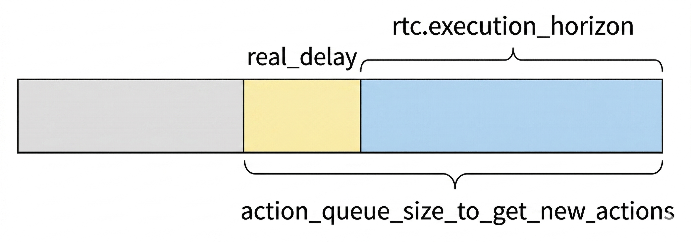

# SmolVLA 复现

## SmolVLA 训练与推理

> [!IMPORTANT]
> 请先把下面命令中的所有 `<...>` 占位符替换成你自己的配置，再运行。

> [!IMPORTANT]
> 如果你使用的是 `smolvla_base`，而你的数据集相机名称是 `front` / `side`，那么训练和推理时都建议加入 `rename_map`。另外，当前部分 LeRobot 版本中的 `lerobot_record.py` 还需要手动补一行 `rename_map` 传递代码，下面会给出修改方法。

### 1. 模型微调

SmolVLA 在这个项目里适合作为一个轻量级 Vision-Language-Action baseline。和 Diffusion、ACT 不同，SmolVLA 更强调“图像 + 状态 + 语言任务描述”联合建模，因此更适合任务描述明确、数据量相对充足的场景。

SmolVLA 更推荐从官方基础模型 `lerobot/smolvla_base` 继续微调，而不是从零开始训练。

训练前先安装依赖：

```bash
pip install -e ".[smolvla]"
```

然后登录 wandb：

```bash
wandb login
```

训练命令如下：

```bash
tmux new -s train
lerobot-train \
  --policy.path=lerobot/smolvla_base \
  --dataset.repo_id=<YOUR_DATASET_REPO_ID> \
  --output_dir=outputs/train/<YOUR_SMOLVLA_OUTPUT_DIR> \
  --job_name=<YOUR_SMOLVLA_JOB_NAME> \
  --policy.device=cuda \
  --batch_size=8 \
  --steps=20000 \
  --wandb.enable=true \
  --rename_map='{"observation.images.front": "observation.images.camera1", "observation.images.side": "observation.images.camera2"}' \    
  --policy.empty_cameras=1 \                #原论文使用3个相机，这里需要设置1个空相机保证匹配
  --policy.push_to_hub=false
```

### 2. 训练参数说明

- `<YOUR_DATASET_REPO_ID>`
  - 训练所使用的数据集。
  - 例如：`your_hf_username/your_dataset_name`

- `<YOUR_SMOLVLA_OUTPUT_DIR>`
  - 本地训练输出目录名称。
  - 例如：`smolvla_pick_place_dataset`

- `<YOUR_SMOLVLA_JOB_NAME>`
  - 当前训练任务名称。
  - 建议与输出目录保持一致。

- `--policy.path=lerobot/smolvla_base`
  - 使用官方提供的 SmolVLA 基础模型继续微调。
  - 一般不建议直接从零开始训练。

- `--batch_size=8`
  - 可以根据自己的显存大小调整，如果显存充足可以增大。

- `--steps=20000`
  - 作为起步验证用的训练步数。
  - 如果效果不够稳定，可以继续增加。

### 3. 训练结果保存位置

训练完成后，模型一般会保存在下面这个目录：

```bash
outputs/train/<YOUR_SMOLVLA_OUTPUT_DIR>/checkpoints/last/pretrained_model
```

如果训练中断，也可以从已有 checkpoint 继续恢复训练：

```bash
lerobot-train \
  --config_path=outputs/train/<YOUR_SMOLVLA_OUTPUT_DIR>/checkpoints/last/pretrained_model/train_config.json \
  --resume=true
```

### 4.1 上传模型到 Hugging Face

如果本地训练确认没有问题，可以把训练好的模型上传到 Hugging Face，方便后续推理直接加载。

```bash
huggingface-cli upload <YOUR_MODEL_REPO_ID> \
  outputs/train/<YOUR_SMOLVLA_OUTPUT_DIR>/checkpoints/last/pretrained_model
```

上传完成后，就可以通过下面这种形式加载模型：

```text
<YOUR_MODEL_REPO_ID>
```

例如：

```text
your_hf_username/your_smolvla_model_name
```

### 4.2 `lerobot_record.py` 中的 `rename_map` 代码修改

当前部分 LeRobot 版本里，`lerobot_record.py` 虽然已经有 `dataset.rename_map` 配置，也会把它传给预处理器，但没有继续传给 `make_policy(...)`。  
如果你直接用 `smolvla_base`，同时相机名还是 `front` / `side`，推理阶段可能会在策略加载时遇到 feature mismatch。

建议把下面这行代码：

```python
policy = None if cfg.policy is None else make_policy(cfg.policy, ds_meta=dataset.meta)
```

改成：

```python
policy = None if cfg.policy is None else make_policy(
    cfg.policy,
    ds_meta=dataset.meta,
    rename_map=cfg.dataset.rename_map if cfg.dataset.rename_map else None,
)
```

修改文件位置：

```text
src/lerobot/scripts/lerobot_record.py
```

这样做的作用是：在加载预训练策略时，也允许 `front -> camera1`、`side -> camera2` 这种映射生效。

### 5. 真机推理与评估

SmolVLA 可以决定是否使用RTC进行异步推理。
#### 1.使用 `lerobot-record` 挂载策略进行真机推理和评估。

这个命令默认是不使用RTC（实时分块），也不进行异步推理的，所以在运行过程中会出现明显的停顿现象，不利于平滑抓取。

命令如下

```bash
lerobot-record \
  --robot.type=so101_follower \
  --robot.port=/dev/ttyACM0 \
  --robot.id=<YOUR_FOLLOWER_ID> \                      #你的从动臂ID
  --robot.cameras='{ front: {type: opencv, index_or_path: "<YOUR_FRONT_CAMERA_PATH>", width: 640, height: 480, fps: 30, fourcc: "MJPG"}, side: {type: opencv, index_or_path: "<YOUR_SIDE_CAMERA_PATH>", width: 640, height: 480, fps: 30, fourcc: "MJPG"} }' \           #相机路径
  --teleop.type=so101_leader \
  --teleop.port=/dev/ttyACM1 \
  --teleop.id=<YOUR_LEADER_ID> \                       #你的引导臂ID
  --display_data=true \
  --dataset.repo_id=<YOUR_EVAL_DATASET_REPO_ID> \      #你要保存的评估数据集路径
  --dataset.num_episodes=10 \                          #重复十轮
  --dataset.single_task="<YOUR_TASK_DESCRIPTION>" \    #你的任务描述，建议与训练集一致
  --dataset.episode_time_s=10 \                        #每轮时间为10s
  --dataset.reset_time_s=6 \                           #每轮回到原位时间6s
  --dataset.reset_max_relative_target=10.0 \
  --dataset.push_to_hub=false \
  --policy.path=<YOUR_MODEL_REPO_ID> \                 #你的模型名称
  --policy.device=cuda \
  --dataset.rename_map='{"observation.images.front": "observation.images.camera1", "observation.images.side": "observation.images.camera2"}' \   #相机名要对应
  --policy.empty_cameras=1 \                           #也需要加入一个空相机
  --policy.n_action_steps=50 \                         #一次推理后动作执行步数，值越大越平滑，但反应会更慢
  --policy.num_steps=10
```
#### 2.使用 `python examples/rtc/eval_with_real_robot.py` 进行真机推理和评估。

这个命令默认进行异步推理，可以通过rtc.enabled=true来手动开启RTC，在运行过程中机械臂会有微小抖动，但是相对平滑。

```bash
python examples/rtc/eval_with_real_robot.py \
  --policy.path=ljx03/smolvla_lerobot_grasp_dataset_50k \
  --policy.device=cuda \
  --rtc.enabled=true \                                  #开启RTC
  --rtc.execution_horizon=35 \                          #预测出新一轮动作序列后，前面多少个动作要和上一轮动作序列衔接  
  --action_queue_size_to_get_new_actions=40 \           #在一个动作队列还剩35步的时候开始进行下一轮推理
  --robot.type=so101_follower \
  --robot.port=/dev/ttyACM0 \
  --robot.id=my_awesome_follower_arm \
  --robot.max_relative_target=20 \
  --rename_map='{"observation.images.front":"observation.images.camera1","observation.images.side":"observation.images.camera2"}' \
  --robot.cameras='{ front: {type: opencv, index_or_path: "/dev/v4l/by-path/pci-0000:08:00.4-usb-0:2.1:1.0-video-index0", width: 640, height: 480, fps: 30, fourcc: "MJPG"}, side: {type: opencv, index_or_path: "/dev/v4l/by-path/pci-0000:08:00.4-usb-0:2.3:1.0-video-index0", width: 640, height: 480, fps: 30, fourcc: "MJPG"} }' \
  --task="Grab the rectangular box and place it into the paper box" \
  --duration=20 \
  --fps=30
```

下图对应一个 `chunk` 内 RTC 相关参数的大致关系，如果 `real_delay` 和 `rtc.execution_horizon` ，那么 `rtc.execution_horizon` 会放弃重合的步数，用原数值减去重合部分来衔接：




### 6. 推理阶段的问题

#### 1. 运行过程中机械臂出现明显停顿。

解决方法：使用第二条命令进行异步推理，双线程进行推理，动作执行的过程中也去进行推理。

#### 2. 运行过程中机械臂出现微小抖动。

解决方法：适当增大 `rtc.execution_horizon`，让预测新动作队列更多和过去动作队列结合，有利于消除抖动。

> [!IMPORTANT]
> 但是注意 `rtc.execution_horizon` 的值必须小于 `action_queue_size_to_get_new_actions`，最好小于 `action_queue_size_to_get_new_actions+real_delay`。  
> `real_delay` 是进行下一轮推理这个时间段运行的动作步数，因为推理需要时间，这个时间动作也在执行。

可以在日志中得到 `real_delay` 时间，同时还知道 `chunk_size`。初步观察抖动可能是由于对过去的结合以及对现在的利用不平衡导致的，所以我们让新预测的序列一半结合前面的序列，一半仅依赖当前观测。

假设执行 `x` 步后开始推理，那么其实要找到这个中间点就是：

```text
2x + real_delay = chunk_size
```

通过这个计算解出 `x`，然后用：

```text
action_queue_size_to_get_new_actions = chunk_size - x
```

得到 `action_queue_size_to_get_new_actions`。

`execution_horizon` 同理，在找到合理 `x` 后，保证 `rtc.execution_horizon` 长度等于 `x` 即可。这样只有初始的预测会多执行一些前面的序列，后面都是一半以前序列一半现在序列，有效改善了平滑性和成功可能。

因为真机验证会有一定延迟和波动，所以可以考虑把 `get_actions` 稍微增大一点，加大 `2-3` 步左右。

经过重复真机验证发现，抓取并不是保证一半结合以前序列一半使用当前序列效果更好。我的 `real_delay` 值大约为 `6-8` 步，也就是 `action_queue_size_to_get_new_actions` 应为 `30` 左右。

但是实机验证发现，将 `action_queue_size_to_get_new_actions` 增大为 `40`，同时也将 `execution_horizon` 增大到 `35`，会让抓取更稳定，成功率更高，也就是几乎让模型进行连续推理，同时鼓励模型更多关注过去的动作，更有助于提升成功率。

这一点有一些类似于 ACT 的实机测试。


smolvla非常适合资源不足又想尝试部署vla的小伙伴们，4060 8G显存的笔记本完全可以做到本地部署。

### 7. 抓取效果示意

下面这个 `gif` 对应 SmolVLA 的一个真机抓取示意，可以直观看到整体动作节奏和抓取过程：


